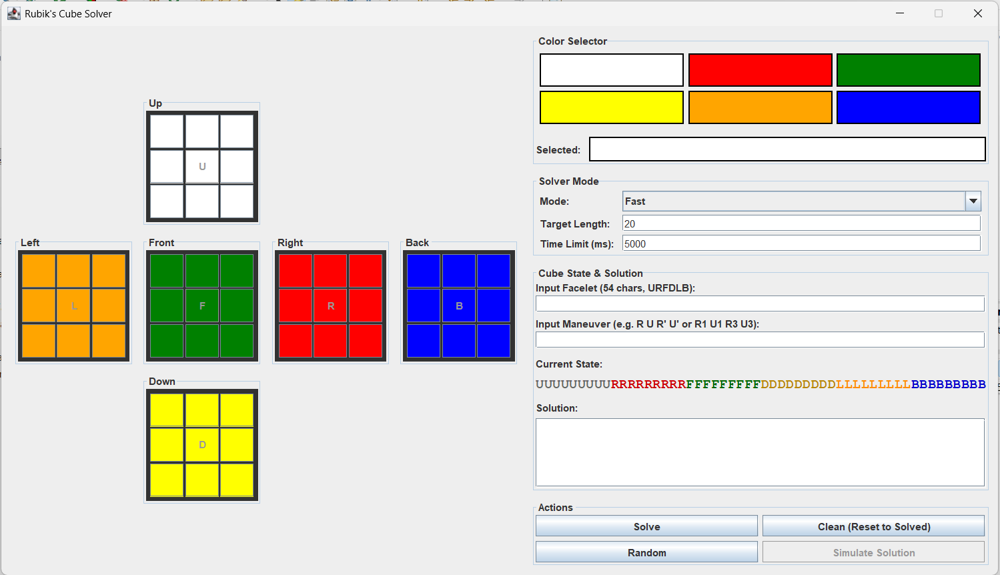

# 🧩 Rubik's Cube Optimal Solver

[](https://openjdk.org/)

A high-performance optimal Rubik’s Cube solver implemented in Java, designed to compute shortest-possible solution using advanced group-theoretic coordinates, symmetry reduction, and large-scale pruning heuristics. This project reproduces the solving techniques used in SOTA optimal solvers while maintaining a clean object-oriented architecture.



## ✨ Features

- **Two-Phase Solver** - Finds good solutions (optimal+1 or better) in under 1 second
- **Optimal Solver** - Proves and finds the mathematically shortest solution using IDA* with 3-axis pruning. **2-4X faster than Cube Explorer** software
- **Smart Optimal Mode** - Hybrid approach: fast initial solve, then proves optimality. **Up to 10X faster than Cube Explorer** (speedup increases for harder cubes)
- **Interactive GUI** - Visual cube editor with click-to-color interface
- **Solution Simulator** - Animated step-by-step visualization of the solving process
- **WCA Standard Notation** - Uses official World Cube Association color scheme and move notation
- **Multi-threaded Search** - Parallel IDA* search for faster optimal solving

## 🏗️ Architecture

The project demonstrates clean Object-Oriented Design principles:

```
┌─────────────────────────────────────────────────────────────┐
│                     <<interface>>                           │
│                        Solver                               │
└───────────────────────────┬─────────────────────────────────┘
                            │ implements
                            ▼
┌─────────────────────────────────────────────────────────────┐
│                   AbstractSolver                            │
│        (Template Method Pattern, shared utilities)          │
└────────────────┬────────────────────────┬───────────────────┘
                 │ extends                │ extends
                 ▼                        ▼
    ┌────────────────────┐    ┌─────────────────────┐
    │   TwoPhaseSolver   │    │   OptimalSolver     │
    │   (Fast, ~0.5s)    │    │   (IDA*, optimal)   │
    └────────────────────┘    └─────────────────────┘
```

### Key Components

| Package | Description |
|---------|-------------|
| `cube.solver` | Solver interface, abstract base, and concrete implementations |
| `cube.model.face` | Facelet-level cube representation (54 stickers) |
| `cube.model.cubie` | Cubie-level representation (corners/edges permutation & orientation) |
| `cube.model.coord` | Coordinate representation for efficient search |
| `cube.moves` | Move tables for coordinate transitions |
| `cube.symmetry` | Symmetry reduction tables (48 symmetries) |
| `cube.pruning` | Pruning tables for IDA* heuristics |
| `cube.gui` | Swing-based graphical user interface |

## 🚀 Getting Started

### Prerequisites

- Java 17 or higher
- Sufficient RAM for loading pruning tables (recommended: 4GB+ heap with `-Xmx4g`)

### Build & Run

```bash
# Clone the repository
git clone https://github.com/abdelmaged92/Rubiks-Cube-Optimal-Solver.git
cd Rubiks-Cube-Optimal-Solver

# Compile
javac -d out -sourcepath src src/cube/gui/RubiksCubeGUI.java

# Run GUI
java -Xmx4g -cp out cube.gui.RubiksCubeGUI

```

> **Note:** First run generates lookup tables (may take some time, anything between 5~20 mins). Subsequent runs loads from the saved files in few seconds.

## 📖 Usage

### GUI Mode

1. **Edit Cube State**: Click any facelet, then click a color to paint it
2. **Random Scramble**: Click "Random" for a valid random cube
3. **Apply Maneuver**: Enter moves like `R U R' U'`
4. **Solve**: Select solver mode and click "Solve"
5. **Simulate**: Click "Simulate Solution" to watch the animated solve

### Solver Modes

| Mode | Description | Use Case |
|------|-------------|----------|
| **Fast** | Two-phase algorithm, optimal+1 or better in <1s | Speed solving, daily use |
| **Optimal** | IDA* search, proves shortest (2-4X faster than Cube Explorer) | Competition analysis |
| **Smart Optimal** | Fast solve → prove optimal (up to 8X faster than Opimal Mode) | Best balance of speed & quality |

### Cube String Format

54 characters representing facelets in URFDLB order:
- **U**: Up face (indices 0-8)
- **R**: Right face (indices 9-17)  
- **F**: Front face (indices 18-26)
- **D**: Down face (indices 27-35)
- **L**: Left face (indices 36-44)
- **B**: Back face (indices 45-53)

Example solved cube: `UUUUUUUUURRRRRRRRRFFFFFFFFFDDDDDDDDDLLLLLLLLLBBBBBBBBB`

## 🔬 Algorithms

### Two-Phase Algorithm (Kociemba)

1. **Phase 1**: Reduce cube to `<U, D, R2, L2, F2, B2>` subgroup
2. **Phase 2**: Solve within the subgroup to reach identity

### Optimal Solver (IDA*)

- Uses 3-axis coordinate representation
- Symmetry reduction (48 symmetries → faster search)
- Admissible heuristics from pruning tables
- Multi-threaded parallel search

Guaranteed shortest solution (God's Number ≤ 20 moves)

## 📊 Performance

### Benchmark: 6 Random Cubes

| # | Cube State | Optimal | Fast | Cube Explorer |
|---|------------|---------|------|---------------|
| 1 | `ULFDUUBL...` | **0.58s** (17f*) | 0.09s (17f) | 2.2s (17f*) |
| 2 | `BURRUFBD...` | **1.72s** (17f*) | 4.59s (17f) | 12.4s (17f*) |
| 3 | `LBDBUBB...` | **5.83s** (18f*) | 9.73s (18f) | 22.9s (18f*) |
| 4 | `FULLUU...` | **11.88s** (18f*) | 0.21s (18f) | 42.5s (18f*) |
| 5 | `RLDUUDFB...` | **7.15s** (17f*) | 0.01s (18f) | 15.8s (17f*) |
| 6 | `RDLLUBFF...` | **30.9s** (18f*) | - | 65.5s (18f*) |

#### Smart Optimal (tested on cubes 1, 4 & 6)

| # | Optimal | Smart Optimal | Speedup |
|---|---------|---------------|---------|
| 1 | 0.58s | **0.52s** | 1.1X |
| 4 | 11.88s | **8.52s** | 1.4X |
| 6 | 30.9s | **6.63s** | 4.7X |

### Detailed Benchmark Results

<details>
<summary><b>Cube 1:</b> ULFDUUBLDRFDRRUFUBRDBDFFFFLULDBDLDBLFRUFLBLRRRBLRBDUUB</summary>

| Solver | Time | Solution |
|--------|------|----------|
| Fast | 0.086s | `U F U F L' B R B2 U' F' U F' D' R D2 B2 R` (17f) |
| Optimal | 0.58s | `U F U F L' B R B2 U' F' U F' D' R D2 B2 R` (17f*) |
| Smart Optimal | 0.522s | Proved Optimal (17f*) |
| Cube Explorer | 2.2s | (17f*) |

**Speedup vs Cube Explorer: 3.8X faster**
</details>

<details>
<summary><b>Cube 2:</b> BURRUFBDBUUUFRBLURDRLLFLDBDFDFLDBLFBLBRRLUFDRFRDLBFUDU</summary>

| Solver | Time | Solution |
|--------|------|----------|
| Fast | 4.593s | `L2 R D2 U B' U2 L2 D B' R' B R' U2 L2 F2 U' B` (17f) |
| Optimal | 1.72s | `R L2 U D2 B' U2 L2 D B' R' B R' U2 L2 F2 U' B` (17f*) |
| Cube Explorer | 12.4s | (17f*) |

**Speedup vs Cube Explorer: 7.2X faster**
</details>

<details>
<summary><b>Cube 3:</b> LBDBUBBDDFLFDRFLULRRRBFLRUFBRULDLRDBBRURLUUFDLDUUBFDFF</summary>

| Solver | Time | Solution |
|--------|------|----------|
| Fast | 0.005s (19f), 9.729s (18f) | `D F2 U2 R' B R' B U B2 U2 B R D2 F' D' U2 B' U'` (18f) |
| Optimal | 5.83s | `U R L' F2 U' F2 B2 D' F2 D' R F B' L' B2 L2 U F'` (18f*) |
| Cube Explorer | 22.9s | (18f*) |

**Speedup vs Cube Explorer: 3.9X faster**
</details>

<details>
<summary><b>Cube 4:</b> FULLUUUFDFLDBRDRRLFURDFLDBBRDURDFLRUUFLFLLBBBFBRRBDBUD</summary>

| Solver | Time | Solution |
|--------|------|----------|
| Fast | 0.206s | `U2 R2 U R2 B2 L' B' D2 L' U' R F L R2 B D L2 B'` (18f) |
| Optimal | 11.88s | `U2 R2 U R2 B2 L' B' D2 L' U' R F R2 L B D L2 B'` (18f*) |
| Smart Optimal | 8.521s | Proved Optimal (18f*) |
| Cube Explorer | 42.5s | (18f*) |

**Speedup vs Cube Explorer: 3.6X (Optimal), 5.0X (Smart Optimal)**
</details>

<details>
<summary><b>Cube 5:</b> RLDUUDFBFUFRRRDDRDLLRRFBRUFUFLRDUBLLBBULLDLFBFFDBBUBDU</summary>

| Solver | Time | Solution |
|--------|------|----------|
| Fast | 0.005s | `L2 D' U' F2 U R2 U2 L2 B2 F' D F R F2 L R' F D2` (18f) |
| Optimal | 7.15s | `L' F R2 B' R2 U' L F U' F2 U' R2 D L F D2 F` (17f*) |
| Cube Explorer | 15.8s | (17f*) |

**Speedup vs Cube Explorer: 2.2X faster**
</details>

<details>
<summary><b>Cube 6:</b> RDLLUBFFDFUBFRDBFUUURRFRDDLLFUUDLDLLUURDLBBRFDBBRBLFBR (harder cube)</summary>

| Solver | Time | Solution |
|--------|------|----------|
| Optimal | 30.9s | `F B2 D' B2 R2 L F U2 R U' B' D F' U2 F B2 U2 B2` (18f*) |
| Smart Optimal | 6.63s | `F B2 D' B2 R2 L F U2 R U' B' D F' U2 F B2 U2 B2` (18f*) |
| Cube Explorer | 65.5s | (18f*) |

**Speedup vs Cube Explorer: 2.1X (Optimal), 9.9X (Smart Optimal)**
</details>

### Summary

| Metric | This Solver | Cube Explorer | Speedup |
|--------|-------------|---------------|---------|
| Average Optimal Time | **9.68s** | 26.88s | **2.8X faster** |
| Best Case | 0.58s | 2.2s | **3.8X faster** |
| Worst Case | 30.9s | 65.5s | **2.1X faster** |

- **Optimal Solver**: Consistently **2-4X faster** than Cube Explorer Huge Optimal
- **Smart Optimal**: **Up to 8X faster** than Optimal Mode (speedup increases for harder cubes - see cube 6: 9.9X)
- **Fast Solver**: Always finds **optimal+1 or better** (often finds optimal) in under 1 second

> **Note**: God's Number for Rubik's Cube is 20 moves - no position requires more than 20 moves to solve optimally.

## 🗂️ Project Structure

```
rubik-cube-solver/
├── src/
│   └── cube/
│       ├── app/            # CLI application
│       ├── gui/            # Swing GUI
│       ├── model/
│       │   ├── face/       # FaceCube, Color, Facelet enums
│       │   ├── cubie/      # CubieCube, Defs
│       │   └── coord/      # CoordCube, TwoPhaseCoordCube
│       ├── moves/          # MoveTables
│       ├── symmetry/       # SymmetryTables
│       ├── solver/         # Solver interface & implementations
│       └── pruning/        # PruningTables
└── README.md
```

## 🙏 Acknowledgments

- Herbert Kociemba for the Two-Phase Algorithm

---

<p align="center">Made with ☕ and 🧊</p>

